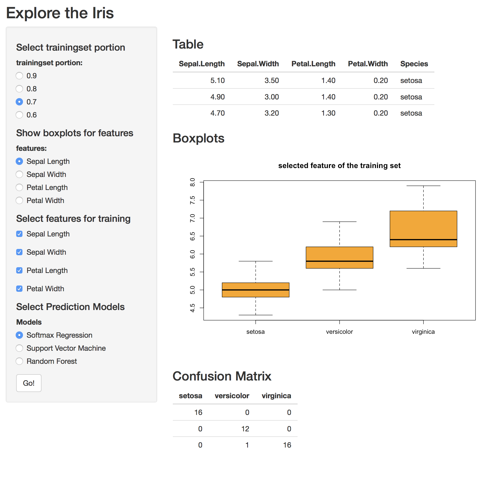

Develop Data Products -- Explore Iris
========================================================
author: AW88525
date: 07122019
autosize: true

Introduction
========================================================

The IrisExplorer is an interactive tool for exploratory data analysis and simple machine learning (prediction) based on the iris dataset in R. 
It enables you to show the variable (feature) distribution with boxplots, adjust parameters such as train/test split, which features to include,
 and lastly choose different prediction models. Finally it outputs the confusion matrix as final output.

The main product includes two parts:
- interactive side panel
- result/graph panel

Interactive side panel
========================================================

- select training portion:
    + radiobuttons: you choose from 0.9, 0.8, 0.7 and 0.6 to perform split of the train and test sets from the iris data
- show boxplots for features:
    + radiobuttons: you choose from the Sepal Length, Sepal Width, Petal Length and Petal Width to show boxplot of the corresponding column
- select features for training
    + checkboxes: you choose from the four features to include in the training and testing datasets. Notice it will prompts errors when no boxes are checked
- select prediction models
    + radiobuttons: you choose from softmax regression, support vector machine and random forest to perform prediction on the test set.
- "Go!" button
    + actionButton: when you select the parameters and models, hit the button and start the training and prediction

Main panel
========================================================

- Table:
   + it shows the first 3 rows of the iris data
- Boxplots:
   + the figure shows boxplots for the selected features in the side panel split by three categories in iris species
   + notice that when you change the trainingset portion, the boxplots will also change as it reflects the distribution of the training set
- Confusion Matrix:
   + it shows the confusion matrix of the predicted results in the test set
   + note that when you deselect or select features, it may prompt error message but once you hit the 'Go!', it will restart training and be okay.
   

Explore and have fun!
=========================================================
- See in this case, if features and parameters are selected as in side panel, the softmax regression predicts very good results as in confusion matrix.

